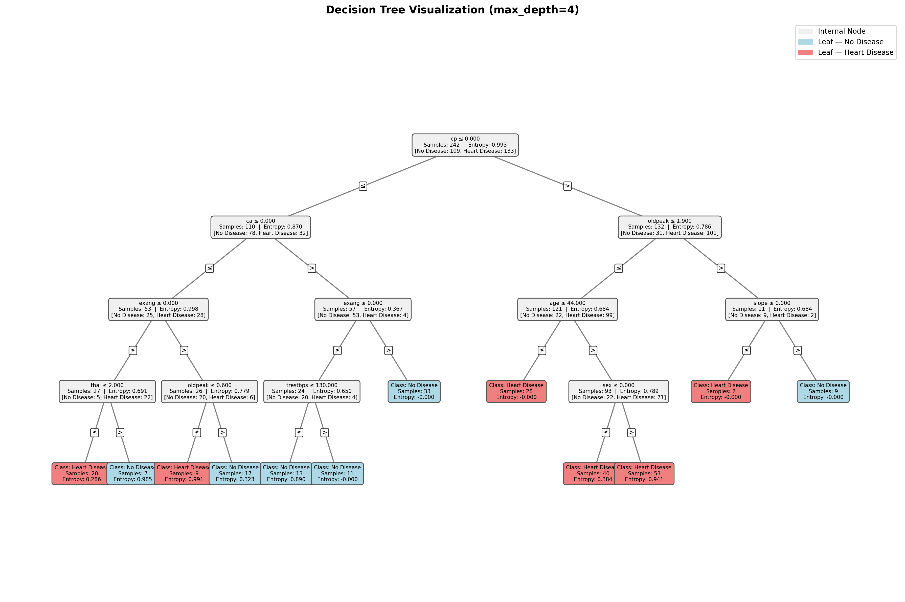

# 🫀 Heart Disease Prediction — Decision Tree & Random Forest from Scratch

> **MLProject** — Implementation of Decision Tree and Random Forest classifiers **from scratch** (no sklearn for the ML algorithms), applied to the UCI Heart Disease dataset, with an interactive Flask web dashboard for hyperparameter tuning and live visualisation.

---

## 📋 Table of Contents

- [Overview](#overview)
- [Project Structure](#project-structure)
- [Algorithms Implemented](#algorithms-implemented)
- [Dataset](#dataset)
- [Getting Started](#getting-started)
- [Usage](#usage)
- [Web Dashboard](#web-dashboard)
- [Results](#results)
- [Tech Stack](#tech-stack)

---

## Overview

This project demonstrates a ground-up implementation of two fundamental machine learning algorithms:

| Algorithm | Key idea |
|---|---|
| **Decision Tree** | Recursively splits data by the feature that maximises information gain (Shannon entropy) |
| **Random Forest** | Bagging ensemble of Decision Trees with random feature sub-sampling; majority vote for prediction |

Both models are applied to predict the presence of heart disease based on 13 clinical features. An interactive Flask dashboard lets you tune hyperparameters and instantly see the effect on model performance.

---

## Project Structure

```
heart-disease-prediction/
│
├── src/                        # From-scratch ML implementations
│   ├── __init__.py
│   ├── decision_tree.py        # Node + DecisionTree (entropy-based CART)
│   └── random_forest.py        # RandomForest (bagging ensemble)
│
├── data/
│   └── heart.csv               # UCI Heart Disease dataset (303 samples, 14 features)
│
├── templates/
│   └── index.html              # Interactive Flask dashboard (HTML/CSS/JS)
│
├── app.py                      # Flask web application (main entry point)
├── evaluate.py                 # CLI: train & benchmark both models
├── visualize.py                # CLI: render Decision Tree as PNG
│
├── requirements.txt
├── .gitignore
└── README.md
```

---

## Algorithms Implemented

### Decision Tree (`src/decision_tree.py`)

- **Split criterion**: Shannon entropy (information gain)
- **Stopping conditions**: max depth, minimum samples to split, pure node
- **Feature sub-sampling**: configurable `n_features` per split (enables use inside Random Forest)
- Fully recursive `_grow_tree` / `_traverse_tree` without any sklearn internals

### Random Forest (`src/random_forest.py`)

- **Bootstrap aggregation**: each tree trains on a random sample with replacement
- **Random feature sub-sampling** at every split (controllable via `n_features`)
- **Majority voting** across all `n_trees` for final prediction
- Configurable: `n_trees`, `max_depth`, `min_samples_split`, `max_samples`, `random_state`

---

## Decision Tree Visualization

The diagram below shows the trained Decision Tree (depth=4) on the Heart Disease dataset.
Each internal node shows the **split feature**, **threshold**, **sample count**, and **entropy**.
Leaf nodes are colour-coded: 🔵 **No Disease** / 🔴 **Heart Disease**.



> Generated with: `python visualize.py --depth 4 --out assets/decision_tree.png`

---

## Dataset

**UCI Heart Disease Dataset** (`data/heart.csv`)

| Property | Value |
|---|---|
| Samples | 303 |
| Features | 13 |
| Target | Binary — `0` No Disease / `1` Heart Disease |
| Train/Test split | 80% / 20% (random_state=42) |

**Features:**

| Column | Description |
|---|---|
| `age` | Age in years |
| `sex` | Sex (1 = male, 0 = female) |
| `cp` | Chest pain type (0–3) |
| `trestbps` | Resting blood pressure (mm Hg) |
| `chol` | Serum cholesterol (mg/dl) |
| `fbs` | Fasting blood sugar > 120 mg/dl (1 = true) |
| `restecg` | Resting ECG results (0–2) |
| `thalach` | Maximum heart rate achieved |
| `exang` | Exercise-induced angina (1 = yes) |
| `oldpeak` | ST depression induced by exercise |
| `slope` | Slope of peak exercise ST segment |
| `ca` | Number of major vessels (0–3) colored by fluoroscopy |
| `thal` | Thalassemia (0 = normal, 1 = fixed defect, 2 = reversible) |

---

## Getting Started

### 1. Clone the repository

```bash
git clone https://github.com/SandipAcharya/heart-disease-prediction.git
cd heart-disease-prediction
```

### 2. Create a virtual environment

```bash
python -m venv .venv
# Windows
.venv\Scripts\activate
# macOS / Linux
source .venv/bin/activate
```

### 3. Install dependencies

```bash
pip install -r requirements.txt
```

---

## Usage

### Run the web dashboard

```bash
python app.py
```

Then open **http://127.0.0.1:5000** in your browser.

---

### Evaluate both models in the terminal

```bash
python evaluate.py
```

Sample output:

```
============================================================
  Decision Tree (from scratch)
============================================================
  Accuracy : 0.7869

============================================================
  Random Forest (from scratch)
============================================================
  Accuracy : 0.8525
```

---

### Visualize the Decision Tree

```bash
# Default: depth=4, output=decision_tree.png
python visualize.py

# Custom depth and output path
python visualize.py --depth 5 --out outputs/tree_depth5.png
```

---

## Web Dashboard

The interactive dashboard (powered by Flask + vanilla JS) allows you to:

- **Tune hyperparameters** in real time:
  - Number of estimators (`n_trees`)
  - Max tree depth
  - Max features per split (`sqrt`, `log2`, `None`, or integer)
  - Bootstrap on/off
  - Bootstrap sample size

- **View live metrics** after each run:
  - Accuracy, Precision, Recall, F1-Score (train & test)

- **Interactive plots**:
  - Confusion matrix heatmap
  - 2-D decision boundary — select any two features from a dropdown

---

## Results

> Best configuration found during experimentation: `n_estimators=20`, `max_depth=15`, `max_features=None`, `bootstrap=True`

| Model | Test Accuracy |
|---|---|
| Decision Tree (scratch) | ~78–80% |
| Random Forest (scratch) | ~82–85% |
| sklearn RandomForestClassifier *(reference)* | ~85% |

---

## Tech Stack

| Layer | Library |
|---|---|
| ML algorithms | Pure Python + NumPy |
| Data processing | pandas |
| Evaluation metrics | scikit-learn (metrics only) |
| Web server | Flask |
| Visualisation | Matplotlib, Seaborn |
| Frontend | HTML5 / CSS3 / Vanilla JS |

---

## Academic Context

This project was developed as part of an **Artificial Intelligence course** project demonstration. The goal was to understand the internals of ensemble methods by implementing them without relying on high-level sklearn estimators.
