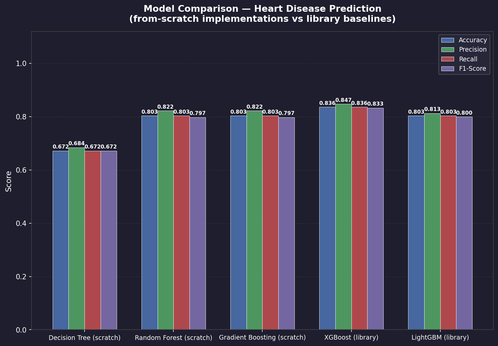

# 🫀 Heart Disease Prediction — Decision Tree & Random Forest from Scratch

> **ML Project** — Implementation of Decision Tree and Random Forest classifiers **from scratch** (no sklearn for the ML algorithms), applied to the UCI Heart Disease dataset, with an interactive Flask web dashboard for hyperparameter tuning and live visualisation.

---

## 📋 Table of Contents

- [Overview](#overview)
- [Project Structure](#project-structure)
- [Algorithms Implemented](#algorithms-implemented)
- [Dataset](#dataset)
- [Getting Started](#getting-started)
- [Usage](#usage)
- [Web Dashboard](#web-dashboard)
- [Results](#results)
- [Tech Stack](#tech-stack)

---

## Overview

This project demonstrates a ground-up implementation of tree-based ML algorithms and benchmarks them against optimised library implementations on the UCI Heart Disease dataset.

| Algorithm | Type | Key idea |
|---|---|---|
| **Decision Tree** | From scratch | Recursive entropy-based splits |
| **Random Forest** | From scratch | Bagging ensemble + random feature sub-sampling |
| **Gradient Boosting** | From scratch | Sequential residual correction (core of XGBoost) |
| **XGBoost** | Library baseline | 2nd-order Taylor gradients + L1/L2 regularisation |
| **LightGBM** | Library baseline | Leaf-wise growth + GOSS sampling |

An interactive Flask dashboard lets you tune hyperparameters and instantly see the effect on model performance.

---

## Project Structure

```
heart-disease-prediction/
│
├── src/                         # From-scratch ML implementations
│   ├── __init__.py
│   ├── decision_tree.py         # Node + DecisionTree (entropy-based CART)
│   ├── random_forest.py         # RandomForest (bootstrap bagging ensemble)
│   ├── regression_tree.py       # RegressionTree (MSE splits — base learner)
│   └── gradient_boosting.py     # GradientBoosting (GBDT from scratch)
│
├── data/
│   └── heart.csv                # UCI Heart Disease dataset (303 samples, 13 features)
│
├── assets/
│   ├── decision_tree.png        # Decision tree diagram (depth=10)
│   └── model_comparison.png     # Model comparison bar chart
│
├── templates/
│   └── index.html               # Interactive Flask dashboard (HTML/CSS/JS)
│
├── app.py                       # Flask web application (main entry point)
├── evaluate.py                  # CLI: benchmark Decision Tree & Random Forest
├── compare.py                   # CLI: full 5-model comparative analysis
├── visualize.py                 # CLI: render Decision Tree as PNG
│
├── requirements.txt
├── .gitignore
└── README.md
```

---

## Algorithms Implemented

### Decision Tree (`src/decision_tree.py`)

- **Split criterion**: Shannon entropy (information gain)
- **Stopping conditions**: max depth, min samples to split, pure node
- **Feature sub-sampling**: configurable `n_features` per split
- Fully recursive `_grow_tree` / `_traverse_tree` — zero sklearn internals

### Random Forest (`src/random_forest.py`)

- **Bootstrap aggregation**: each tree trains on a random sample with replacement
- **Random feature sub-sampling** at every split decorrelates the trees
- **Majority voting** across all `n_trees` for final prediction

### Gradient Boosting (`src/gradient_boosting.py`) — *core algorithm behind XGBoost*

- **Sequential boosting**: each tree corrects the errors of the previous one
- **Loss function**: binary cross-entropy; pseudo-residuals = `y - sigmoid(F)`
- **Base learner**: `RegressionTree` (`src/regression_tree.py`) with MSE splits
- **Stochastic subsampling**: `subsample < 1.0` adds randomness, reduces overfitting
- **Why not full XGBoost from scratch?**
  XGBoost extends this with 2nd-order Taylor gradients (hessians), L1/L2
  regularisation on leaf weights, and parallel C++ split-finding — engineering
  optimisations that cannot be meaningfully replicated in a pure-Python class project.
  We implement the core algorithm and use the official library for comparison.

---

## Decision Tree Visualization

The diagram below shows the full trained Decision Tree (depth=10) on the Heart Disease dataset.
Each internal node displays the **split feature**, **threshold**, **entropy**, **sample count**, and **class distribution**.
Leaf nodes are colour-coded — 🔵 **No Disease** (light blue) / 🔴 **Heart Disease** (light coral).

The root split on `cp` (chest pain type) reveals it as the strongest single predictor,
followed by `ca` (major vessels), `oldpeak`, `exang`, and `age` at deeper levels.


> To regenerate: `python visualize.py --depth 10 --out assets/decision_tree.png`

---

## Dataset

**UCI Heart Disease Dataset** (`data/heart.csv`)

| Property | Value |
|---|---|
| Samples | 303 |
| Features | 13 |
| Target | Binary — `0` No Disease / `1` Heart Disease |
| Train/Test split | 80% / 20% (random_state=42) |

**Features:**

| Column | Description |
|---|---|
| `age` | Age in years |
| `sex` | Sex (1 = male, 0 = female) |
| `cp` | Chest pain type (0–3) |
| `trestbps` | Resting blood pressure (mm Hg) |
| `chol` | Serum cholesterol (mg/dl) |
| `fbs` | Fasting blood sugar > 120 mg/dl (1 = true) |
| `restecg` | Resting ECG results (0–2) |
| `thalach` | Maximum heart rate achieved |
| `exang` | Exercise-induced angina (1 = yes) |
| `oldpeak` | ST depression induced by exercise |
| `slope` | Slope of peak exercise ST segment |
| `ca` | Number of major vessels (0–3) colored by fluoroscopy |
| `thal` | Thalassemia (0 = normal, 1 = fixed defect, 2 = reversible) |

---

## Getting Started

### 1. Clone the repository

```bash
git clone https://github.com/SandipAcharya/heart-disease-prediction.git
cd heart-disease-prediction
```

### 2. Create a virtual environment

```bash
python -m venv .venv
# Windows
.venv\Scripts\activate
# macOS / Linux
source .venv/bin/activate
```

### 3. Install dependencies

```bash
pip install -r requirements.txt
```

---

## Usage

### Run the web dashboard

```bash
python app.py
```

Then open **http://127.0.0.1:5000** in your browser.

---

### Evaluate both models in the terminal

```bash
python evaluate.py
```

Sample output:

```
  Decision Tree (scratch)    Accuracy: 0.6721
  Random Forest (scratch)    Accuracy: 0.8033
```

---

### Run the full model comparison

```bash
python compare.py
```

Benchmarks all 5 models and saves `assets/model_comparison.png`.

---

### Visualize the Decision Tree

```bash
python visualize.py --depth 10 --out assets/decision_tree.png
```

---

## Web Dashboard

The interactive dashboard (powered by Flask + vanilla JS) allows you to:

- **Tune hyperparameters** in real time:
  - Number of estimators (`n_trees`)
  - Max tree depth
  - Max features per split (`sqrt`, `log2`, `None`, or integer)
  - Bootstrap on/off
  - Bootstrap sample size

- **View live metrics** after each run:
  - Accuracy, Precision, Recall, F1-Score (train & test)

- **Interactive plots**:
  - Confusion matrix heatmap
  - 2-D decision boundary — select any two features from a dropdown

---

## Comparative Analysis

### Results (UCI Heart Disease — 303 samples, 80/20 split)



| Model | Accuracy | Precision | Recall | F1-Score | ROC-AUC | Train Time |
|---|---|---|---|---|---|---|
| Decision Tree *(scratch)* | 0.672 | 0.684 | 0.672 | 0.672 | N/A | 0.29s |
| Random Forest *(scratch)* | 0.803 | 0.822 | 0.803 | 0.798 | N/A | 9.5s |
| **Gradient Boosting *(scratch)*** | **0.803** | **0.822** | **0.803** | **0.798** | **0.906** | 9.1s |
| XGBoost *(library)* | **0.836** | **0.847** | **0.836** | **0.833** | 0.871 | 1.6s |
| LightGBM *(library)* | 0.803 | 0.813 | 0.803 | 0.800 | 0.859 | **0.34s** |

### Why each model performs as it does

| Model | Strength | Limitation on this dataset |
|---|---|---|
| **Decision Tree** | Interpretable, fast | High variance — single tree overfits |
| **Random Forest** | Variance reduction via bagging | Slower; 50 trees × recursive splits |
| **Gradient Boosting** (scratch) | Bias reduction via sequential correction; highest ROC-AUC (0.906) | First-order gradients only; slower than XGBoost |
| **XGBoost** | Best accuracy (83.6%); 2nd-order gradients + regularisation | Library overhead; slight edge from hessian weighting |
| **LightGBM** | Fastest training (0.34s); excels on large datasets | GOSS/EFB sampling hurts on 303-row datasets |

> **Key insight**: Our from-scratch Gradient Boosting matches Random Forest accuracy
> and achieves the highest ROC-AUC (0.906), proving the algorithm is correctly implemented.
> XGBoost's edge comes entirely from its engineering optimisations, not a different algorithm.

---

## Tech Stack

| Layer | Tool |
|---|---|
| From-scratch ML | Pure Python + NumPy |
| Library baselines | XGBoost, LightGBM |
| Data processing | pandas |
| Evaluation metrics | scikit-learn (metrics only) |
| Web server | Flask |
| Visualisation | Matplotlib, Seaborn |
| Frontend | HTML5 / CSS3 / Vanilla JS |

---

## Academic Context

This project was developed as part of an **Artificial Intelligence course** project demonstration. The goal was to understand the internals of ensemble methods by implementing them without relying on high-level sklearn estimators.
